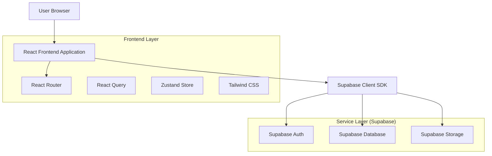
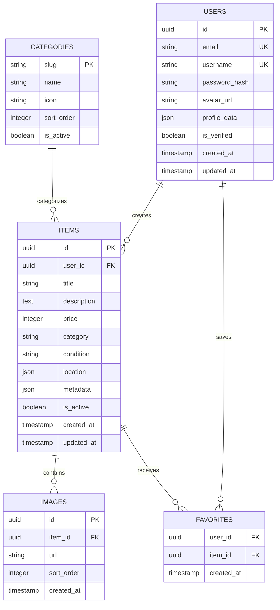

## 1. Architecture Design



## 2. Technology Description

- **Frontend**: React@18 + tailwindcss@3 + vite
- **Initialization Tool**: vite-init
- **State Management**: React Query@4 + Zustand@4
- **Routing**: React Router@6
- **Backend**: Supabase (Auth, Database, Storage)
- **UI Components**: Headless UI + Heroicons
- **Image Processing**: Browser Image Compression

## 3. Route Definitions

| Route | Purpose |
|-------|---------|
| / | Home page with featured listings and item feed |
| /browse | Browse all items with filters and search |
| /browse/:category | Category-specific item browsing |
| /item/:id | Individual item details page |
| /sell | Create new listing form |
| /sell/edit/:id | Edit existing listing |
| /profile/:username | Public user profile |
| /profile/settings | User settings and preferences |
| /profile/listings | Manage user's listings |
| /login | User authentication page |
| /register | User registration page |
| /forgot-password | Password recovery page |

## 4. API Definitions

### 4.1 Authentication APIs

**User Registration**
```
POST /auth/v1/signup
```

Request:
| Param Name | Param Type | isRequired | Description |
|------------|------------|------------|-------------|
| email | string | true | User email address |
| password | string | true | User password (min 6 chars) |
| username | string | true | Unique username |

Response:
```json
{
  "user": {
    "id": "uuid",
    "email": "user@example.com",
    "username": "johndoe",
    "created_at": "2024-01-01T00:00:00Z"
  },
  "session": {
    "access_token": "jwt_token",
    "refresh_token": "refresh_token"
  }
}
```

**User Login**
```
POST /auth/v1/token?grant_type=password
```

### 4.2 Item Management APIs

**Create Listing**
```
POST /rest/v1/items
```

Request:
| Param Name | Param Type | isRequired | Description |
|------------|------------|------------|-------------|
| title | string | true | Item title (max 100 chars) |
| description | string | true | Item description (max 2000 chars) |
| price | number | true | Price in cents |
| category | string | true | Category slug |
| condition | string | true | 'new', 'like_new', 'good', 'fair', 'poor' |
| images | array | true | Array of image URLs |
| location | object | false | {city, state, coordinates} |
| metadata | object | false | Additional specifications |

**Update Listing**
```
PATCH /rest/v1/items?id=eq.{id}
```

**Delete Listing**
```
DELETE /rest/v1/items?id=eq.{id}
```

### 4.3 Search and Filter APIs

**Search Items**
```
GET /rest/v1/items?title=ilike.*{query}*
```

**Filter Items**
```
GET /rest/v1/items?category=eq.{category}&price=gte.{min_price}&price=lte.{max_price}
```

## 5. Database Schema

### 5.1 Data Model Definition



### 5.2 Data Definition Language

**Users Table**
```sql
CREATE TABLE users (
    id UUID PRIMARY KEY DEFAULT gen_random_uuid(),
    email VARCHAR(255) UNIQUE NOT NULL,
    username VARCHAR(50) UNIQUE NOT NULL,
    password_hash VARCHAR(255) NOT NULL,
    avatar_url TEXT,
    profile_data JSONB DEFAULT '{}',
    is_verified BOOLEAN DEFAULT FALSE,
    created_at TIMESTAMP WITH TIME ZONE DEFAULT NOW(),
    updated_at TIMESTAMP WITH TIME ZONE DEFAULT NOW()
);

-- Enable RLS
ALTER TABLE users ENABLE ROW LEVEL SECURITY;

-- Create policies
CREATE POLICY "Users can view their own profile" 
    ON users FOR SELECT 
    USING (auth.uid() = id);

CREATE POLICY "Users can update their own profile" 
    ON users FOR UPDATE 
    USING (auth.uid() = id);
```

**Items Table**
```sql
CREATE TABLE items (
    id UUID PRIMARY KEY DEFAULT gen_random_uuid(),
    user_id UUID REFERENCES users(id) ON DELETE CASCADE,
    title VARCHAR(100) NOT NULL,
    description TEXT NOT NULL,
    price INTEGER NOT NULL CHECK (price >= 0),
    category VARCHAR(50) NOT NULL,
    condition VARCHAR(20) NOT NULL CHECK (condition IN ('new', 'like_new', 'good', 'fair', 'poor')),
    location JSONB DEFAULT '{}',
    metadata JSONB DEFAULT '{}',
    is_active BOOLEAN DEFAULT TRUE,
    created_at TIMESTAMP WITH TIME ZONE DEFAULT NOW(),
    updated_at TIMESTAMP WITH TIME ZONE DEFAULT NOW()
);

-- Indexes for performance
CREATE INDEX idx_items_user_id ON items(user_id);
CREATE INDEX idx_items_category ON items(category);
CREATE INDEX idx_items_price ON items(price);
CREATE INDEX idx_items_created_at ON items(created_at DESC);
CREATE INDEX idx_items_active ON items(is_active) WHERE is_active = TRUE;

-- Enable RLS
ALTER TABLE items ENABLE ROW LEVEL SECURITY;

-- Create policies
CREATE POLICY "Anyone can view active items" 
    ON items FOR SELECT 
    USING (is_active = TRUE);

CREATE POLICY "Users can create their own items" 
    ON items FOR INSERT 
    WITH CHECK (auth.uid() = user_id);

CREATE POLICY "Users can update their own items" 
    ON items FOR UPDATE 
    USING (auth.uid() = user_id);

CREATE POLICY "Users can delete their own items" 
    ON items FOR DELETE 
    USING (auth.uid() = user_id);
```

**Images Table**
```sql
CREATE TABLE images (
    id UUID PRIMARY KEY DEFAULT gen_random_uuid(),
    item_id UUID REFERENCES items(id) ON DELETE CASCADE,
    url TEXT NOT NULL,
    sort_order INTEGER DEFAULT 0,
    created_at TIMESTAMP WITH TIME ZONE DEFAULT NOW()
);

CREATE INDEX idx_images_item_id ON images(item_id);
CREATE INDEX idx_images_sort_order ON images(item_id, sort_order);
```

**Categories Table**
```sql
CREATE TABLE categories (
    slug VARCHAR(50) PRIMARY KEY,
    name VARCHAR(100) NOT NULL,
    icon VARCHAR(50),
    sort_order INTEGER DEFAULT 0,
    is_active BOOLEAN DEFAULT TRUE
);

-- Insert initial categories
INSERT INTO categories (slug, name, icon, sort_order) VALUES
('electronics', 'Electronics', 'device-phone-mobile', 1),
('clothing', 'Clothing', 'shirt', 2),
('home-garden', 'Home & Garden', 'home', 3),
('sports', 'Sports & Outdoors', 'sport', 4),
('books', 'Books & Media', 'book-open', 5),
('vehicles', 'Vehicles', 'truck', 6),
('toys', 'Toys & Games', 'puzzle-piece', 7),
('jewelry', 'Jewelry & Accessories', 'sparkles', 8);
```

**Favorites Table**
```sql
CREATE TABLE favorites (
    user_id UUID REFERENCES users(id) ON DELETE CASCADE,
    item_id UUID REFERENCES items(id) ON DELETE CASCADE,
    created_at TIMESTAMP WITH TIME ZONE DEFAULT NOW(),
    PRIMARY KEY (user_id, item_id)
);

CREATE INDEX idx_favorites_user_id ON favorites(user_id);
CREATE INDEX idx_favorites_item_id ON favorites(item_id);

-- Enable RLS
ALTER TABLE favorites ENABLE ROW LEVEL SECURITY;

CREATE POLICY "Users can manage their own favorites" 
    ON favorites FOR ALL 
    USING (auth.uid() = user_id);
```

## 6. Security Considerations

### 6.1 Authentication Security
- JWT tokens with 1-hour expiration
- Refresh token rotation
- Rate limiting on authentication endpoints
- Email verification required for selling

### 6.2 Data Security
- Row Level Security (RLS) enabled on all tables
- Image upload validation (file type, size limits)
- SQL injection prevention through parameterized queries
- XSS protection through input sanitization

### 6.3 Storage Configuration
```sql
-- Storage bucket for item images
INSERT INTO storage.buckets (id, name, public, file_size_limit, allowed_mime_types) 
VALUES ('item-images', 'item-images', true, 5242880, ARRAY['image/jpeg', 'image/png', 'image/webp']);

-- Storage policies
CREATE POLICY "Anyone can view images" ON storage.objects FOR SELECT USING (bucket_id = 'item-images');
CREATE POLICY "Authenticated users can upload images" ON storage.objects FOR INSERT WITH CHECK (
    bucket_id = 'item-images' AND auth.role() = 'authenticated'
);
```

## 7. Performance Optimization

### 7.1 Frontend Optimizations
- Code splitting by route
- Image lazy loading with Intersection Observer
- Virtual scrolling for long lists
- Service worker for offline functionality
- React.memo for expensive components

### 7.2 Database Optimizations
- Proper indexing on frequently queried columns
- Materialized views for complex aggregations
- Connection pooling with PgBouncer
- Query result caching with Redis (future enhancement)

### 7.3 CDN Configuration
- Static assets served through CDN
- Image optimization with on-the-fly resizing
- Browser caching headers for static resources