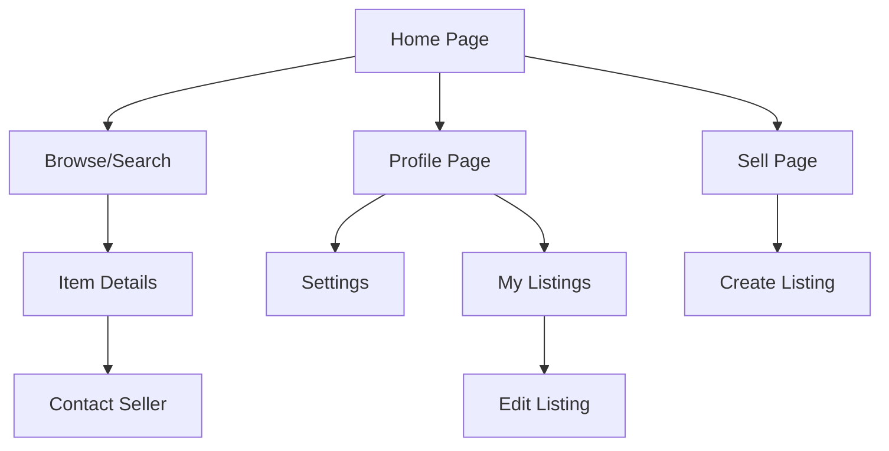

## 1. Product Overview
Bought is a modern marketplace platform that connects buyers and sellers for goods exchange. Users can create profiles, list items for sale with detailed metadata, and browse available items through an intuitive interface.

The platform solves the problem of fragmented local marketplaces by providing a unified, user-friendly solution for buying and selling goods online. It targets individuals looking to buy or sell personal items, small businesses, and local entrepreneurs.

## 2. Core Features

### 2.1 User Roles
| Role | Registration Method | Core Permissions |
|------|---------------------|------------------|
| Guest User | Browse without registration | View items, search listings |
| Registered User | Email registration | Create listings, manage profile, buy items, save favorites |
| Admin | Manual creation | Moderate listings, manage users, platform settings |

### 2.2 Feature Module
Our marketplace requirements consist of the following main pages:
1. **Home page**: item feed, search bar, category navigation, featured listings.
2. **Profile page**: user information, listed items, purchase history, settings access.
3. **Sell page**: item creation form, image upload, metadata input, listing management.
4. **Item details page**: product information, seller details, contact options, related items.
5. **Browse page**: filtered search results, sorting options, category browsing.
6. **Settings page**: account preferences, notification settings, privacy controls.

### 2.3 Page Details
| Page Name | Module Name | Feature description |
|-----------|-------------|---------------------|
| Home page | Hero section | Display featured listings with image carousel and quick stats. |
| Home page | Search bar | Allow users to search items by keywords with autocomplete suggestions. |
| Home page | Category navigation | Show product categories with item counts for easy browsing. |
| Home page | Item feed | Display recent listings in grid layout with pagination. |
| Profile page | User info | Show profile picture, username, join date, and verification status. |
| Profile page | Listed items | Display user's active listings with edit/delete options. |
| Profile page | Purchase history | Show completed transactions with item details and dates. |
| Sell page | Item form | Input fields for title, description, price, category, and condition. |
| Sell page | Image upload | Drag-and-drop multiple images with preview and reordering. |
| Sell page | Metadata input | Add specifications like brand, size, color, location, and tags. |
| Sell page | Listing management | Save drafts, publish listings, and edit existing items. |
| Item details page | Product gallery | Image carousel with zoom functionality and thumbnail navigation. |
| Item details page | Item information | Display title, price, description, condition, and metadata. |
| Item details page | Seller card | Show seller profile, rating, response time, and contact button. |
| Item details page | Related items | Suggest similar listings based on category and price range. |
| Browse page | Filter sidebar | Filter by category, price range, condition, location, and date. |
| Browse page | Sort options | Sort by relevance, price, date posted, and distance. |
| Browse page | Results grid | Display filtered items with quick view and save functionality. |
| Settings page | Account settings | Update profile information, change password, manage email. |
| Settings page | Notification preferences | Configure email and push notifications for different activities. |
| Settings page | Privacy controls | Manage profile visibility and data sharing preferences. |

## 3. Core Process

### User Registration Flow
Users can register via email to access full platform features. Guest users can browse but cannot create listings or contact sellers.

### Selling Process Flow
1. User navigates to Sell page from navigation menu
2. Fills out item details including title, description, price, and category
3. Uploads multiple images with drag-and-drop functionality
4. Adds metadata such as condition, brand, size, and location
5. Reviews listing preview before publishing
6. Listing appears in search results and user profile

### Buying Process Flow
1. User browses items on Home page or uses search functionality
2. Applies filters for category, price range, or location
3. Clicks on item to view detailed information
4. Contacts seller through platform messaging
5. Completes transaction outside platform (initial version)

## 4. User Interface Design

### 4.1 Design Style
- **Primary Colors**: Deep blue (#1E40AF) for primary actions, white (#FFFFFF) for backgrounds
- **Secondary Colors**: Light gray (#F3F4F6) for cards, green (#10B981) for success states
- **Button Style**: Rounded corners (8px radius), subtle shadows, hover effects
- **Typography**: Inter font family, 16px base size, clear hierarchy with font weights 400-700
- **Layout**: Card-based design with consistent spacing (8px grid system)
- **Icons**: Minimalist line icons from Heroicons library

### 4.2 Page Design Overview
| Page Name | Module Name | UI Elements |
|-----------|-------------|-------------|
| Home page | Hero section | Full-width banner with featured items carousel, auto-rotating every 5 seconds |
| Home page | Search bar | Centered search input with 48px height, rounded corners, search icon |
| Home page | Category navigation | Horizontal scrollable pills with category icons and item counts |
| Home page | Item feed | Responsive grid (4 columns desktop, 2 tablet, 1 mobile), card shadows on hover |
| Profile page | User header | Circular profile picture (120px), username in 24px bold, join date |
| Profile page | Tab navigation | Underline-style tabs for Listings, History, Settings |
| Sell page | Form sections | White cards with 16px padding, clear section headers, progressive disclosure |
| Sell page | Image upload | Dashed border dropzone, thumbnail grid with delete icons, upload progress |
| Item details page | Image gallery | Full-width carousel with dot indicators, pinch-to-zoom on mobile |
| Item details page | Info panel | Sticky sidebar on desktop, stacked layout on mobile |
| Browse page | Filter sidebar | Collapsible accordion filters, clear all button, apply filters button |
| Settings page | Form groups | Card-based sections with toggle switches and input fields |

### 4.3 Responsiveness
Desktop-first design approach with mobile adaptation. Breakpoints at 768px (tablet) and 1024px (desktop). Touch-optimized interactions for mobile devices including swipe gestures for image galleries and pull-to-refresh functionality.

### 4.4 Performance Considerations
- Image lazy loading for item feeds
- Progressive image loading with blur-up effect
- Virtual scrolling for long lists
- Optimistic UI updates for user actions