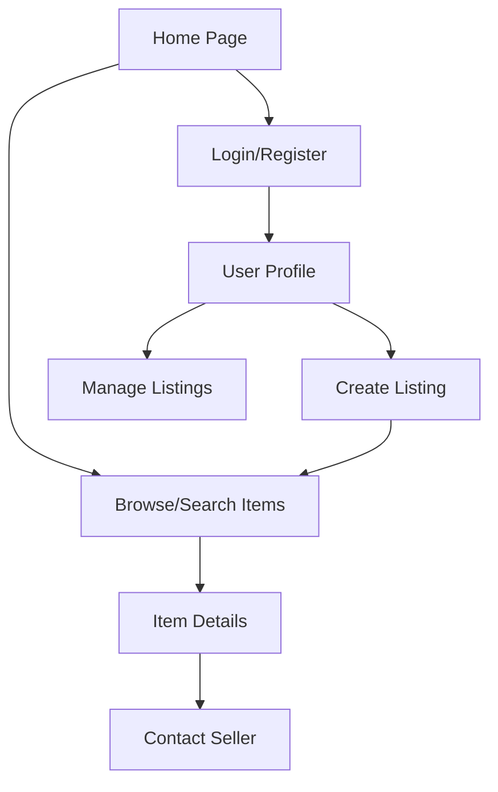

## 1. Product Overview
Bought is a modern, community-focused marketplace PWA that allows users to buy and sell goods locally. It features secure authentication, real-time listings, and a responsive design optimized for mobile and desktop. The app helps communities connect through local commerce while maintaining security and privacy.

Target market: Local communities seeking a simple, secure marketplace platform with mobile-first design and offline capabilities.

## 2. Core Features

### 2.1 User Roles
| Role | Registration Method | Core Permissions |
|------|---------------------|------------------|
| Guest User | No registration required | Browse listings, view categories, search items |
| Registered User | Email registration | Create listings, manage own items, add favorites, upload images |

### 2.2 Feature Module
Our marketplace requirements consist of the following main pages:
1. **Home page**: Browse listings, category navigation, search functionality, hero section.
2. **Item Details page**: View item details, seller information, image gallery, contact seller.
3. **Create Listing page**: Add new item with photos, description, price, and category selection.
4. **User Profile page**: View user's listings, manage own items, edit profile information.
5. **Login/Register page**: User authentication with email and password.

### 2.3 Page Details
| Page Name | Module Name | Feature description |
|-----------|-------------|---------------------|
| Home page | Hero section | Display welcome message with marketplace value proposition and call-to-action. |
| Home page | Category Navigation | Browse items by categories (Electronics, Clothing, Home & Garden, Vehicles, Books, Sports, Other). |
| Home page | Search & Filter | Search items by title/description, filter by price range and category. |
| Home page | Item Grid | Display paginated grid of item cards with image, title, price, and seller info. |
| Item Details page | Image Gallery | Show multiple item images with zoom capability and responsive layout. |
| Item Details page | Item Information | Display title, description, price, condition, category, and posting date. |
| Item Details page | Seller Information | Show seller name, join date, and other items from same seller. |
| Create Listing page | Image Upload | Drag-and-drop or browse to upload multiple item photos with preview. |
| Create Listing page | Item Details Form | Input fields for title, description, price, condition, and category selection. |
| Create Listing page | Publish Button | Submit listing with validation and success confirmation. |
| User Profile page | User Info | Display user name, join date, and profile overview. |
| User Profile page | My Listings | Show all items posted by the user with edit/delete capabilities. |
| User Profile page | Favorites | Display items bookmarked by the user for quick access. |
| Login/Register page | Authentication Form | Email/password login and registration with validation and error handling. |

## 3. Core Process
User Flow:
1. Guest users can browse all listings, search, and filter items without registration.
2. Users register with email and password to create listings or save favorites.
3. Registered users can create new listings with photos and detailed descriptions.
4. Buyers can view item details and contact sellers through the platform.
5. Users manage their listings and favorites through their profile page.

## 4. User Interface Design

### 4.1 Design Style
- **Primary Color**: #1d4ed8 (blue-700) - Professional and trustworthy
- **Secondary Color**: #f3f4f6 (gray-100) - Clean and modern background
- **Button Style**: Rounded corners with hover states and clear call-to-action
- **Font**: System fonts for optimal performance and readability
- **Layout**: Card-based design with consistent spacing and responsive grid
- **Icons**: Lucide React icons for consistent visual language

### 4.2 Page Design Overview
| Page Name | Module Name | UI Elements |
|-----------|-------------|-------------|
| Home page | Hero section | Full-width banner with gradient overlay, clear headline, and prominent CTA button. |
| Home page | Category Navigation | Horizontal scrollable category pills with icons and active state indicators. |
| Home page | Item Grid | Responsive grid (1-4 columns) with card shadows, hover effects, and loading skeletons. |
| Item Details page | Image Gallery | Full-width hero image with thumbnail navigation below, zoom on click. |
| Item Details page | Item Information | Clean card layout with price prominently displayed, condition badges, and detailed description. |
| Create Listing page | Image Upload | Drag-and-drop zone with image preview grid, file size limits, and upload progress. |
| User Profile page | My Listings | Tabbed interface with grid layout matching home page design consistency. |

### 4.3 Responsiveness
Desktop-first design approach with mobile optimization. The app uses Tailwind CSS responsive utilities to adapt from desktop (4-column grid) to tablet (2-column) to mobile (single column). Touch interactions are optimized for mobile users with appropriate tap targets and swipe gestures for image galleries.

### 4.4 PWA Features
The app includes a web app manifest for installability, service worker for offline functionality, and responsive design that works seamlessly across devices. Users can install the app on mobile and desktop for a