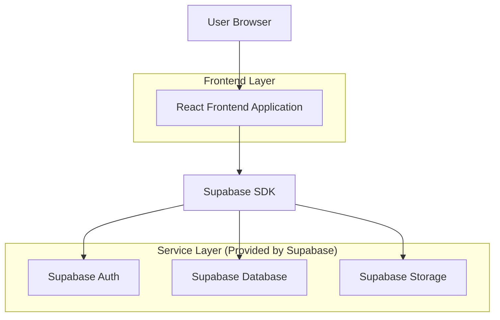
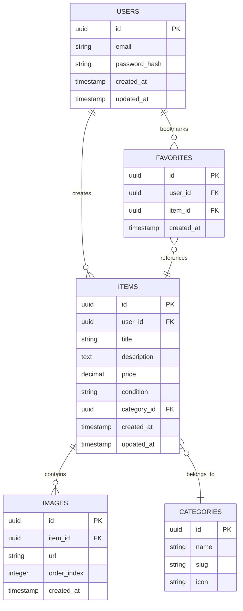

## 1. Architecture Design



## 2. Technology Description

* **Frontend**: React\@18 + TypeScript + Tailwind CSS + Vite

* **Initialization Tool**: vite-init

* **Backend**: Supabase (Auth, Database, Storage)

* **State Management**: TanStack Query + Zustand

* **Icons**: Lucide React

## 3. Route Definitions

| Route            | Purpose                                               |
| ---------------- | ----------------------------------------------------- |
| /                | Home page, displays marketplace listings and search   |
| /login           | Login page, user authentication                       |
| /register        | Registration page, new user signup                    |
| /item/:id        | Item details page, view specific listing              |
| /create          | Create listing page, add new item for sale            |
| /profile/:userId | User profile page, view user information and listings |
| /profile         | Current user profile, manage own listings             |

## 4. API Definitions

### 4.1 Supabase Client API

Authentication

```typescript
// Sign up
const { data, error } = await supabase.auth.signUp({
  email: string,
  password: string
})

// Sign in
const { data, error } = await supabase.auth.signInWithPassword({
  email: string,
  password: string
})

// Sign out
const { error } = await supabase.auth.signOut()
```

Database Operations

```typescript
// Get items with filters
const { data, error } = await supabase
  .from('items')
  .select(`*, users(*), images(*)`)
  .eq('category', category)
  .gte('price', minPrice)
  .lte('price', maxPrice)
  .ilike('title', `%${search}%`)

// Create item
const { data, error } = await supabase
  .from('items')
  .insert([{
    title: string,
    description: string,
    price: number,
    condition: string,
    category: string,
    user_id: string
  }])

// Upload image
const { data, error } = await supabase
  .storage
  .from('item-images')
  .upload(fileName, file)
```

## 5. Data Model

### 5.1 Data Model Definition



### 5.2 Data Definition Language

Users Table
